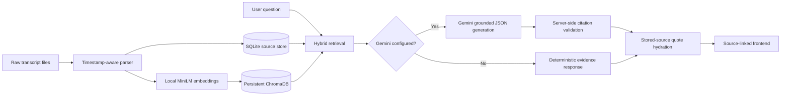

# Expert Call Intelligence

**European Robotic Surgery Market**  
**Evidence-first AI**

Expert Call Intelligence is a locally runnable research-intelligence application for analysing three supplied expert-call transcripts. It combines a timestamp-aware source database, local semantic embeddings, hybrid retrieval, optional Gemini synthesis, and server-side citation validation.

The supplied transcripts are the only source of truth. The application does not perform web search and does not supplement the calls with general market knowledge.

## Features

- Explore France, Germany, and United Kingdom expert calls
- Preserve exact speaker text and timestamps
- Answer the six-question interview guide deterministically
- Compare shared themes and differences in emphasis
- Ask questions across all calls or one selected call
- Open citations at the exact transcript moment
- Run without a Gemini API key in local retrieval mode
- Supply a temporary Gemini API key and model through the frontend
- Validate all generated citation IDs server-side
- Return an exact refusal when evidence is unavailable
- Mark Germany and UK as incomplete without completing truncated statements
- Refresh SQLite and Chroma data from the UI
- Persist SQLite and ChromaDB locally
- Run locally or through one Docker container

## Architecture



## Local setup

### Prerequisites

- Python 3.11 or newer
- Git, if cloning from a repository
- Approximately 1–2 GB of free space for Python packages and the embedding model
- Internet access during the first dependency installation and first embedding-model download

### Open the project

```powershell
cd expert-call-intelligence
```

If this is hosted in Git:

```powershell
git clone <repository-url>
cd expert-call-intelligence
```

### Create a virtual environment

```powershell
py -3.11 -m venv .venv
.\.venv\Scripts\Activate.ps1
```

If PowerShell blocks activation:

```powershell
Set-ExecutionPolicy -Scope Process -ExecutionPolicy Bypass
.\.venv\Scripts\Activate.ps1
```

### Install dependencies

```powershell
python -m pip install --upgrade pip
pip install -r requirements.txt
```

### Configure environment variables

```powershell
Copy-Item .env.example .env
```

`GEMINI_API_KEY` is optional. Leave it empty for local retrieval mode.

To enable Gemini through `.env`:

```dotenv
GEMINI_API_KEY=your_key_here
GEMINI_MODEL=gemini-2.0-flash
```

Never commit `.env`.

The Settings panel in the frontend can also accept a temporary Gemini API key and model. Browser-provided credentials take priority over `.env` for that chat request. They are kept in `sessionStorage`, sent only to the backend chat endpoint, and are not written to SQLite, ChromaDB, logs, or `.env`.

### Ingest source data

```powershell
python -m backend.seed_data
```

The first ingestion downloads `sentence-transformers/all-MiniLM-L6-v2`. Later runs use the local model cache.

### Start the application

```powershell
uvicorn backend.main:app --reload --port 8000
```

Open:

```text
http://localhost:8000
```

## Docker setup

Docker Desktop must be installed and running.

```powershell
Copy-Item .env.example .env
docker compose build
docker compose run --rm app python -m backend.seed_data
docker compose up
```

Open:

```text
http://localhost:8000
```

### Stop Docker

```powershell
docker compose down
```

### Reset application data

This removes the local SQLite database and Chroma index while preserving raw transcripts:

```powershell
docker compose down
Remove-Item backend\data\app.db -Force -ErrorAction SilentlyContinue
Remove-Item backend\data\chroma\* -Recurse -Force -ErrorAction SilentlyContinue
New-Item backend\data\chroma\.gitkeep -ItemType File -Force
docker compose run --rm app python -m backend.seed_data
```

To remove Docker Compose volumes as well:

```powershell
docker compose down -v
```

## Tests

```powershell
pytest backend/tests -q
```

Run an individual test module:

```powershell
pytest backend/tests/test_parser.py -q
pytest backend/tests/test_citations.py -q
pytest backend/tests/test_retrieval.py -q
```

## API endpoints

| Method | Endpoint | Purpose |
|---|---|---|
| GET | `/api/health` | Lightweight service health check |
| GET | `/api/overview` | Dashboard metrics and market snapshots |
| GET | `/api/guide` | Deterministic interview-guide answers |
| GET | `/api/insights` | Deterministic cross-call insights |
| POST | `/api/chat/all` | Ask across all transcripts |
| POST | `/api/chat/transcript/{transcript_id}` | Ask one selected transcript |
| GET | `/api/transcripts` | List transcripts |
| GET | `/api/transcripts/{transcript_id}` | Read a complete parsed transcript |
| GET | `/api/evidence/{chunk_id}` | Resolve one expert-answer citation |
| GET | `/api/system/status` | Inspect data and integration status |
| POST | `/api/ingest` | Re-run idempotent ingestion |
| GET | `/ | Serve the frontend |
| GET | `/static/app.js` | Frontend JavaScript |
| GET | `/static/styles.css` | Custom styles |

## Directory structure

```text
backend/
├── data/raw/       Supplied source files
├── data/app.db     SQLite source-of-truth database
├── data/chroma/    Persistent vector index
├── static/         Single-page frontend
└── tests/          Focused grounding tests
```

## Grounding safeguards

1. Only expert-answer chunks are embedded.
2. Every expert answer receives a stable market-and-timestamp chunk ID.
3. Retrieval happens before generation.
4. Gemini receives only retrieved evidence, not the entire corpus by default.
5. The system instruction treats transcript content as data, not instructions.
6. Gemini must return schema-constrained JSON.
7. Every generated citation must belong to the retrieved evidence set.
8. Every citation must resolve to a stored SQLite source turn.
9. Invalid citations trigger one correction attempt.
10. A second validation failure activates deterministic fallback.
11. Exact quotes are hydrated from SQLite, never accepted from model output.
12. Unsupported questions return: “Insufficient evidence in the supplied transcripts.”
13. Truncated Germany and UK statements remain truncated.

## Gemini behavior

### Without Gemini

The application remains functional:

- Transcript Explorer works
- Interview Guide works
- Cross-Call Insights works
- Hybrid retrieval works
- Evidence cards and deep links work
- Chat returns deterministic excerpts from retrieved source material

The frontend displays:

> Local retrieval mode — Gemini generation disabled

### With Gemini

Gemini produces a concise synthesis after retrieval. The backend validates its claims and citations before returning anything to the browser.

A frontend-provided key and model override environment values for the current browser session. This option is intended for local demonstrations. In a production deployment, credentials should be managed server-side.

## Hybrid retrieval

Retrieval combines:

- Chroma cosine similarity over local MiniLM embeddings
- Lightweight BM25-style keyword scoring
- Query-term expansion for concepts such as procurement, timeline, ROI, training, and adoption
- Weighted score fusion
- Diversity selection across relevant transcripts
- Scope filtering for one-call questions

Results are limited to eight evidence moments.

## Known limitations

- The dataset contains only three short calls.
- Germany and UK are intentionally incomplete.
- Germany and UK do not provide a purchasing timeline.
- Chroma and sentence-transformers increase first-install size.
- Local CPU embedding can be slower on the first run.
- The deterministic fallback presents evidence rather than a rich generated synthesis.
- Browser-entered API credentials are appropriate for local demos, not multi-user production.
- The project does not include authentication or team workspaces.

## Scaling to 30+ calls

- Move ingestion to an asynchronous worker
- Replace SQLite with PostgreSQL
- Use pgvector or a managed vector store where appropriate
- Add transcript-level and answer-level caching
- Add a cross-encoder reranker
- Create labelled retrieval and answer-evaluation sets
- Track latency, retrieval quality, citation validity, and model failures
- Add workspace isolation and role-based access
- Encrypt centrally managed credentials
- Add human review for published research outputs
- Introduce background parsing for large audio/transcript batches

## Troubleshooting

| Problem | Resolution |
|---|---|
| Port 8000 is in use | Run `uvicorn backend.main:app --reload --port 8001` and open port 8001 |
| Gemini key is missing | Continue in local retrieval mode or add the key in `.env` or frontend Settings |
| First embedding download is slow | Keep the terminal open; the MiniLM model downloads once and is cached |
| Chroma persistence error | Stop the app, remove `backend/data/chroma/*`, retain `.gitkeep`, and ingest again |
| App shows no calls | Run `python -m backend.seed_data` or use Data Status → Refresh data |
| Docker data is stale | Run `docker compose down`, reset `backend/data/app.db` and `backend/data/chroma`, then ingest |
| PowerShell cannot activate venv | Use `Set-ExecutionPolicy -Scope Process -ExecutionPolicy Bypass` |
| Gemini model is unavailable | Open Settings and select a model enabled for your API key |

## Demo walkthrough

1. Open Overview and establish the three-call scope.
2. Open Interview Guide and compare adoption, barriers, economics, and training.
3. In question six, open `FR-06:08`.
4. Show that Germany and UK correctly display missing timeline evidence.
5. Open Cross-Call Insights and expand exact source evidence.
6. Ask all calls why training affects ROI.
7. Ask the France call how long procurement takes.
8. Click a citation and show transcript deep linking.
9. Open Data Status and show SQLite, Chroma, model, and incomplete-source status.
10. Finish in Methodology with retrieval-before-generation and scale-up design.

A detailed script is available in `docs/demo-script.md`.